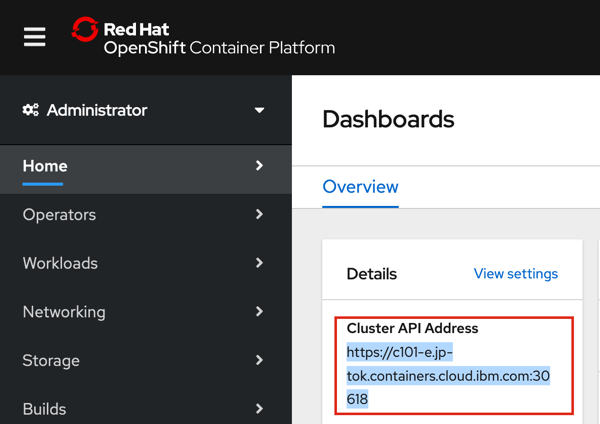

# create-IBM-cp4i-components-instances
The asset provided here will help you to create the instance or helm rleases of
- APIConnect
- App Connect DashBoard
- App Connect Designer
- MQ
- DataPower
- EventStreams
	- Stateless
	- Statefull
- AssetRepository
- Tracing

## Pre-Requisite
1. IBM Cloud Account
2. IBM Cloud Pak for Integration v 2020.1.1 is deployed on ROKS (RedHat OpenShift Kubernetes Services )
3. IBM Cloud CLI tools
	- ibmcloud CLI  to access IBM Cloud
	- IBM cloud Pak cli to manage the Cloud Pak resources
	- helm cli to manage the helm release
	- oc  Open Shift CLI to manage Openshift cluster
4. Get the API Key of your Cloud Account
5. Get some of the Key information for the scripts


## Setting up the required CLI

Log in to IBM Cloud https://cloud.ibm.com/

Navigate to page where you have Cloud Pak for Integration cluster listed
https://cloud.ibm.com/kubernetes/clusters

```
Click on the Name of your cluster which would take you to "Overview" of the Cluster and show the Cluster summary
Summary
Cluster ID 			bqg5ktdt0665m180fsa0
Master status 		Ready
Version 			4.3.12_1520
Zones 				sng01
Created				4/15/2020, 8:23 PM
Ingress subdomain	cluster-4-cp4i-aab031765f1e8f31f12a8fbbfd4e92f2-0000.sng01.containers.appdomain.cloud
Resource group		cp4i_resource_grp
Image pull secrets 	Enabled

```

Follow the below URL to set up Opneshift cli
	https://cloud.ibm.com/docs/openshift?topic=openshift-openshift-cli#cli_oc
	Required version of 'oc' is 4.3.x. ( I used 4.3.10-202004011847-081196c)		

Use the below command to set up ibmcloud cli
```
curl -sL https://ibm.biz/idt-installer | bash
```
For Installing IBM Cloud Pak cli, kubectl cli , helm cli, 
```
Log in to https://icp-console.<Ingress subdomain of OCP Cluster>  (The Ingress Domain can be taken from Cluster summary page)
	username:admin
	password: <provide the one you have provided while installing CP4I>
```	

In ICP Console, Navigate to the page 
```
https://icp-console.<Ingress subdomain of OCP Cluster>/common-nav/cli where IBM Cloud Pak CLI tools are available for download	
```	
Based on your OS, Choose the cli and install


## Get the API Key of your Cloud Account
Follow the below link to get your account API Key 
	https://cloud.ibm.com/docs/iam?topic=iam-manapikey
This key will be used in the script (ibm_cloud_login_using_api_key.sh). Keep a note of the API Key.

## Get some of the Key information for the scripts

- Key information for **./Common/setup_global_env.sh**
	- For setting values for **OC_SERVER** 

		Log in to OpenShift Admin Console. From the Dashboard , Note down Cluster API Address
			  

		For the below export variable	  
			* export OC_SERVER=PROVIDE_YOUR_OpenShift_Cluster_API_Server_URL
		
		replace "PROVIDE_YOUR_OpenShift_Cluster_API_Server_URL" with the Cluster API URL Address 
		  
	- For setting values for **OCP_CLUSTER_SUBDOMAIN**
		
		Note down **Ingress subdomain** values from OCP Cluster Summary. Refer to section "Setting up the required CLI"

		For the below export variable	
			* export OCP_CLUSTER_SUBDOMAIN=PROVIDE_YOUR_OpenShift_Cluster_SubDomain

		replace "PROVIDE_YOUR_OpenShift_Cluster_SubDomain" with the **Ingress subdomain**

	- For setting values for **DOCKER_PASSWORD** we need to get the IBM Entitled Registry key. 
		
		The IBM Entitled Registry contains images for the Platform Navigator, Asset Repository and all of the component 
		capabilities in IBM Cloud Pak for Integration. To use the IBM Entitled Registry, you must first obtain an Entitlement key. Take the following steps.
		#   Obtain an Entitlement key from https://myibm.ibm.com/products-services/containerlibrary (IBM Container Library). Click Get an entitlement key if you are not on the entitlement page.
		#    Click IBM Cloud Pak for Integration.
		#    Copy the entitlement key presented to a safe place for use later.
		

		For the below export variable	
			* export DOCKER_PASSWORD="PROVIDE_YOUR_Entitlement_Key"
		
		replace "PROVIDE_YOUR_Entitlement_Key" with the **Entitlement key** 


- Key information for **./IBM-Cloud-Access-Details/ibm_cloud_login_using_api_key.sh**
	- For setting values for **IBMCLOUD_API_KEY**
		
		For the below export variable	  
			* export IBMCLOUD_API_KEY=PROVIDE_YOUR_IBM_Cloud_API_Key
		
		replace "PROVIDE_YOUR_IBM_Cloud_API_Key" with the API Key noted in the previous section **Get the API Key of your Cloud Account**


	- For setting values for **CLOUD_ACCOUNT_ID**
		
		Log in to IBM Cloud https://cloud.ibm.com/ Get the Account ID from Account Settings
			  
		
		For the below export variable	  
			* export CLOUD_ACCOUNT_ID=PROVIDE_YOUR_IBM_Cloud_Account_Id
		
		replace "PROVIDE_YOUR_OpenShift_Cluster_API_Server_URL" with the Account ID


	- For setting values for **CLUSTER_NAME**
		
		Navigate to page ```https://cloud.ibm.com/kubernetes/clusters``` where you have Cloud Pak for Integration cluster listed.
		Note down the name of the OCP cluster

		For the below export variable	  
			* export **CLUSTER_NAME=PROVIDE_YOUR_OpenShift_Cluster_Name**
		
		replace "PROVIDE_YOUR_OpenShift_Cluster_Name" with the OCP cluster name 

